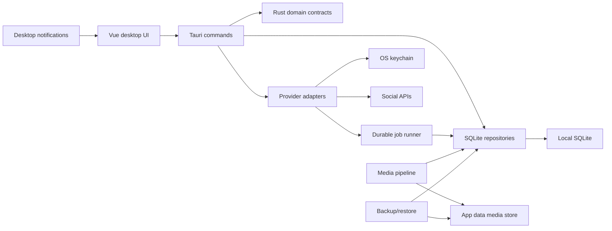

# Dust Wave Social Migration

Status date: 2026-06-25

This repository started as Mixpost Lite, a Laravel package with a Vue/Inertia frontend. Dust Wave Social is the incremental Tauri/Rust desktop replacement being built alongside the existing package so parity can be verified without breaking the current code.

## Goals

- Manage Dust Wave social accounts from one desktop app.
- Preserve Mixpost Lite feature parity before adding Dust Wave-only product extensions.
- Move local app state, scheduling, publishing, imports, reporting, media handling, and system maintenance into Rust-backed modules.
- Keep provider-specific rules explicit so X/Twitter, Facebook Page, Mastodon, Facebook Group, and future networks can evolve independently.
- Prefer local-first storage, predictable background work, OS-backed secrets, product-grade backup/restore, and small Tauri commands over a server-shaped desktop app.
- Preserve social publishing safety as a product requirement: clear operator intent, minimal data collection, redacted logs/exports, recoverable background work, and abuse-risk review before shipping automation or provider changes.

## Current Parity Scope

- Dashboard and provider reports.
- Social accounts, OAuth callbacks, refresh, delete, authorization state, and Facebook Page entity selection.
- Posts, drafts, scheduled posts, failed posts, duplication, filters, tags, account-specific versions, provider validation, previews, and bulk delete.
- Calendar month, day, and week scheduling views.
- Media uploads, local GIF imports, stock media, Klipy GIF search, external media download for permitted sources, image thumbnails, video thumbnails, and orphan cleanup.
- Services for X/Twitter, Facebook/Meta, Mastodon app registration, Unsplash, and Klipy. Tenor is retired Mixpost context only.
- Settings, local profile replacement, system status, system logs, in-app health state, and desktop notifications.
- Background work for scheduled publishing, provider rate-limit deferral, account imports, audience snapshots, metrics aggregation, cleanup, stale-job recovery, and temporary-file pruning.

## Desktop Parity Decisions

- Laravel profile, password, logout, and CSRF refresh flows are web-session concerns. The desktop replacement is local profile settings, OS-backed service/account secrets, and normal app/window lifecycle.
- Mixpost mail-based unauthorized-account notifications are replaced by in-app health state plus native desktop notifications.
- Log listing/download/clear maps to local SQLite-backed system logs with app-data exports, not Laravel `storage/logs` files.
- Migration, schema, release-readiness, diagnostics, raw queue, and provider capability map panels are not production product UI.
- Facebook Group is a Dust Wave extension target after Mixpost parity, because the bundled Mixpost manager does not register it as an active provider.
- Ethical product review lives in `docs/BEST_PRACTICES.md` and is required for features that affect publishing, automation, credentials, imports, media, reporting, backup/restore, notifications, or support exports.

## Ethical Product Guardrails

Dust Wave Social is a social publishing tool, so parity is not only UI and API behavior. New work must also preserve safe operational behavior:

- Externally visible actions should require clear operator intent through account selection, preview, scheduling state, and confirmation for high-impact actions.
- Background jobs should be product-visible and recoverable without exposing raw queue controls in the shipped app.
- Local data should stay minimal and understandable: SQLite for app state, app-owned media storage, OS keychain for secrets, redacted logs, and manifest-based backups.
- Automation should not hide provider errors, rate limits, rejected media, account authorization failures, or unsupported publishing combinations.
- Support workflows should help operators recover without leaking tokens, API keys, client secrets, refresh tokens, or unnecessary account data.
- Future AI, bulk automation, cloud sync, team collaboration, or new-provider work must include the risk review from `docs/BEST_PRACTICES.md` before implementation.

## Current App Inventory

The Laravel package exposes these user workflows:

- Dashboard and provider reports.
- Account connect, OAuth callback, account update/delete, and provider entity selection.
- Posts list, create, edit, save draft, schedule, duplicate, delete, bulk delete, filter, tag, and account-specific post versions.
- Calendar month/week views with scheduled post editing entry points.
- Media library, local uploads including GIFs, stock media, Klipy GIF search, external media download for permitted sources, image resize, and video thumbnail generation.
- Tags create/update/delete.
- Settings for timezone, date format, time format, week start, admin email, and default accounts.
- Services for X/Twitter, Facebook/Meta, Klipy, Unsplash, and Mastodon app creation. Tenor is retired Mixpost context only.
- Profile, password update, system status, log listing/download/clear, logout, and CSRF refresh.

The current background work includes:

- Scheduled post publishing.
- Account-level publish jobs with provider rate-limit handling.
- Audience imports for X/Twitter, Facebook Page, and Mastodon.
- Post/insight imports for X/Twitter, Facebook Page, and Mastodon.
- Metrics processing for X/Twitter and Mastodon.
- Temporary media cleanup and old-data pruning.
- Unauthorized-account notifications.

## First Desktop Slice

The desktop slice adds:

- `src-tauri/`: Tauri v2 app shell and Rust command surface.
- `resources/desktop/`: independent Dust Wave Vue/Vite desktop entry.
- `src-tauri/migrations/0001_initial.sql`: SQLite schema preserving the Mixpost Lite model and adding durable job/rate-limit tables.
- Rust provider capability contracts for X/Twitter, Facebook Page, Mastodon, and future Facebook Group handling.
- Rust database initialization, ordered migration tracking, settings load/save, and product health commands.
- Rust local data repositories for accounts, posts, post versions, media, tags, services, jobs, reports, metrics, audience, and system logs.
- Product backup/restore, replacing the previous hidden local-backup utility.
- OS-keychain-backed service and account credentials.
- A packageable macOS app/DMG path without removing the Laravel package.

The existing Laravel package, routes, migrations, tests, and asset build remain in place until Dust Wave explicitly cuts over.

## Target Architecture



Primary Rust modules:

- `domain`: serializable contracts for accounts, providers, posts, schedules, media, reports, settings, backups, and system health.
- `db`: SQLite migrations and repositories.
- `providers`: X/Twitter, Facebook Page, and Mastodon parity adapters first; Facebook Group later as a Dust Wave extension.
- `jobs`: persisted scheduler and retry worker replacing Laravel scheduled commands and Horizon batches.
- `media`: app-data media storage, image resizing, video thumbnail generation, and temporary-file cleanup.
- `secrets`: OS-keychain-backed service credentials and account tokens.
- `tauri_commands`: small frontend API with explicit permissions and narrow payloads.

## Functional Parity Status

### M0: Desktop Foundation

Status: complete.

- Independent Tauri app exists without disturbing Laravel.
- SQLite initializes in the Tauri app data directory.
- Health, settings, account, post, calendar, media, tag, service, report, system log, backup, and maintenance commands are exposed through the desktop command surface.
- macOS app/DMG packaging is configured.
- Existing `npm run dev` and `npm run build` for Laravel assets remain intact.

Acceptance:

- `npm run desktop:release:check` passes.
- Launching the desktop app creates the local database and displays product workflows, not migration/development panels.

### M1: Local Data Core

Status: complete for product use.

- Repositories exist for accounts, posts, post versions, media, tags, services, settings, imports, metrics, audience, job queue, rate limits, system logs, and backup metadata.
- Query APIs exist for the dashboard, posts list, calendar, media library, reports, system status, and logs.
- Snapshot tests cover representative account/post/tag/media/job relationships.
- Tags, accounts, services, media, draft posts, scheduled posts, duplicate posts, post updates, filtered queries, dashboard summaries, report aggregates, and settings are backed by SQLite.
- Schema migrations run from an ordered, idempotent migration list.
- Schema version 3 adds job idempotency keys with an active-job uniqueness guard for durable queue deduplication.

Decommissioned:

- The hidden Mixpost SQLite import and verification path is removed from active product architecture. If Dust Wave needs to migrate a production Mixpost database later, build a dedicated one-time utility outside the shipped app.
- Hidden diagnostics export code is removed from active product architecture. User support should use product logs, backup/restore, and documented app-data paths.

### M2: Account And Service Management

Status: complete for local parity, pending live provider acceptance.

- Desktop service rows store active state and secret-reference metadata without raw credentials in SQLite.
- Credential readiness reports cover X/Twitter, Facebook/Meta, Unsplash, and Klipy required fields. Klipy is the MVP GIF provider; Tenor is retired context because the third-party Tenor API shutdown window has passed.
- OS-keychain-backed credential saves support media search and OAuth/publishing adapters, with environment-backed credentials still available as fallback.
- Mastodon app registration uses `https://{server}/api/v1/apps`, stores returned client credentials in the OS keychain, and returns an authorization URL.
- Mastodon, X/Twitter, and Facebook Page OAuth connection flows store account tokens in the OS keychain and persist local account rows.
- Connected Mastodon, X/Twitter, and Facebook Page accounts can refresh profile/account metadata.
- Unauthorized or invalid credentials surface through system health instead of failing silently deeper in publishing/import work.

Acceptance:

- Dust Wave can connect, refresh, update, and delete parity accounts.
- Provider account data and secrets survive app restarts.
- Missing or invalid service config is surfaced before OAuth begins.

### M3: Composer, Scheduling, And Calendar

Status: complete for local parity.

- Draft creation, updating, scheduling, duplicate, soft delete, bulk delete, retry, and post validation exist.
- The desktop composer supports original and account-specific versions, labels, media selection, autosave/recovery, invalid schedule handling, provider previews, and a schedule/post-now action bar.
- Provider validation enforces max text length, max media counts, missing media references, mixed-media restrictions, empty content, and X/Twitter simultaneous-posting restrictions.
- Post queries mirror Mixpost status, keyword, account, tag, and calendar date-window filters.
- Calendar month/day cells and the hourly week grid are backed by the same post query model.

Acceptance:

- A user can create, edit, schedule, post now, duplicate, tag, filter, retry, and delete posts with Mixpost-equivalent behavior.
- Calendar and posts list stay consistent after edits.

### M4: Publishing And Jobs

Status: complete for local parity, pending live provider acceptance.

- `run_due_jobs` reserves pending due work and returns a structured worker summary to the desktop UI.
- The desktop shell starts an in-app worker loop while the app is open, with pause/resume and manual run controls.
- `publish_post` jobs apply publish-state transitions in SQLite without Laravel queues.
- Active app/account rate-limit records defer publish jobs by returning them to pending with a later `run_at`.
- Scheduled publish jobs use stable per-post idempotency keys.
- Stale processing jobs can be requeued explicitly.
- Failed posts include account-level error JSON and can be retried with a fresh schedule time.
- Connected Mastodon posts upload media, publish statuses, and persist provider IDs/responses.
- Connected X/Twitter posts upload media, create posts, and persist tweet IDs/responses.
- Connected Facebook Page text/photo/video posts use the Graph publishing flows and persist provider IDs/responses.

Acceptance:

- Scheduled posts publish without Laravel queues or cron.
- Provider rate-limit responses delay only the affected app/account scope.
- Failed posts include actionable error context and can be retried.

### M5: Media Pipeline

Status: complete for local parity with Apple Silicon bundled FFmpeg/FFprobe staged, pending clean target-Mac acceptance.

- Local file imports copy source assets into the app-data `media/` store.
- External media downloads stream permitted file/HTTP(S) sources into the app-data `media/` store with source attribution JSON.
- Unsplash search returns Mixpost-style external media items that can be downloaded when its API and attribution requirements are satisfied.
- Klipy search returns Mixpost-style GIF results for preview, selection, and posting, but Klipy binaries must not be imported into reusable app media unless Klipy gives written permission. Selected Klipy items should be stored as provider references and fetched only transiently during publish.
- Media import/download enforces Mixpost-compatible MIME and per-type size limits.
- JPEG/PNG media generate deterministic `thumb` image-resize conversion files.
- Video imports/downloads generate `thumb` JPEG frame conversions when `ffmpeg`/`ffprobe` are available, System status reports whether each tool is bundled/configured/installed, and release builds can opt into Tauri-packaged media sidecars.
- Uploaded media fetch returns Mixpost-style resource fields, keyword/type filtering, and desktop previews through scoped Tauri asset URLs.
- Media deletion removes app-owned imported files while preserving safety around unmanaged metadata paths.
- Orphan cleanup removes unreferenced files from the app media store.

Acceptance:

- Media can be added from local files, URLs, stock search, and local/manual GIF imports. Klipy GIFs can be searched, previewed, selected, and posted through a non-persistent provider-reference flow. Production GIF search depends on the Klipy attribution, content-filter, production credential, and live acceptance gate in `docs/GIF_PROVIDER_DECISION.md`.
- Generated thumbnails/conversions are deterministic and survive app restarts.
- Provider validation blocks invalid media combinations before publish jobs are created.

### M6: Analytics, Imports, And Reports

Status: complete for local parity, pending live provider acceptance.

- Connected Mastodon accounts can import today's audience total and recent statuses.
- Connected X/Twitter accounts can import today's follower total and recent non-reply, non-retweet posts.
- Connected Facebook Page accounts can import today's follower total and supported Page insight metrics.
- Imported post metrics are aggregated into daily `metrics` rows with Mixpost-compatible keys.
- Account imports can be queued as durable `import_account_data` jobs with per-account idempotency keys.
- Failed account-import jobs can be retried without requeuing failed publish jobs through the wrong path.
- Dashboard and report panels use local SQLite summaries and period windows.

Acceptance:

- Dashboard and report totals match Mixpost Lite for imported parity fixtures.
- Imports resume safely after app restart and do not duplicate data.

### M7: System, Packaging, Updates, And Cutover

Status: in progress.

- Desktop system logs use a local SQLite-backed `dust-wave-system.log` projection with redacted previews, export, and clear commands.
- The production desktop UI no longer shows Local Data Store, Migration Milestones, Release Readiness, database schema, raw queue controls, or provider capability map panels.
- The desktop shell has a consolidated system health panel for unauthorized accounts, failed posts, queued work, provider limits, service credential readiness, and stale processing work.
- System health can clear resolved local state while preserving failed work and failed posts for review.
- Settings include a persisted desktop notification preference and test action.
- Backup restore validates Dust Wave manifests before replacing the local database.
- Combined maintenance includes resolved queue/provider-limit cleanup and reclaimed orphaned media.
- System support actions can copy the app-data path without exposing raw database panels.
- Native desktop file pickers are available for local media import while preserving manual path entry for scripted workflows.
- OAuth start flows hand authorization URLs to the OS browser through Tauri's opener plugin, with in-panel retry buttons if browser handoff fails.
- Tauri plugin permissions are scoped to the needed file-open dialogs, URL opening, notification, and backup/restore flows.
- Release readiness lives in `desktop:release:*` scripts, CI, and `RELEASE.md`, not in product UI.
- Desktop CI runs release checks on pushes/pull requests and can build/upload unsigned macOS artifacts.
- GitHub Releases updater scaffolding is present, with final signing keys and endpoints to be filled when release hosting is ready.
- macOS icon variants and `.icns` are generated from the `dust-wave-square` logo.

Acceptance:

- Dust Wave can be installed, backed up, restored, updated, and opened as a signed desktop app.
- A real Dust Wave account set can run day-to-day without the Laravel server.

## Provider Notes

Initial parity providers:

- X/Twitter: local adapter uses OAuth 2.0 PKCE, media upload, post creation, account refresh, post import, audience import, and metric aggregation. X API tier behavior must still be validated against current Dust Wave account requirements.
- Facebook Page: local adapter uses Meta OAuth, Page entity selection, Page feed/photo/video publishing, account refresh, audience import, and Page insights.
- Mastodon: local adapter creates per-server apps, performs OAuth, uploads media with polling, publishes statuses, imports followers, imports statuses, and imports status metrics.

Future provider extensions:

- Facebook Group is explicitly planned as a Dust Wave extension after parity.
- Other candidates are Instagram Business, LinkedIn, Pinterest, TikTok, YouTube, and Bluesky. Add them only after API constraints are mapped into provider capabilities.

## Resolved Audit Items

- The desktop Mastodon app-registration adapter uses `https://{server}/api/v1/apps` and validates returned client credentials before saving them to the OS keychain.

## Current-Code Audit Items

- `src/Abstracts/SocialProvider.php` calls `Account::updateAccessToken()`, but no matching method was found during initial inspection.
- Several provider config reads for `allow_mixing` appear to omit the `media_limit` nesting.
- Provider behavior in the original package is lightly tested compared with controller/action CRUD behavior.
- X/Twitter API tier behavior should be validated against current Dust Wave account requirements during live acceptance.

## Commands

Existing package:

```bash
npm run dev
npm run build
```

Dust Wave desktop:

```bash
npm run desktop:dev
npm run desktop:build
```

Release checks:

```bash
npm run desktop:release:check
```

Rust-only checks from `src-tauri`:

```bash
cargo check
cargo test
```

## Manual Gates Before Cutover

- Provider credentials and live account acceptance for X/Twitter, Facebook Page, Mastodon, Unsplash, and Klipy. Production GIF acceptance requires completing the Klipy gate in `docs/GIF_PROVIDER_DECISION.md`.
- Apple Developer ID signing, notarization, and Gatekeeper validation.
- GitHub Releases updater signing keys and release endpoint finalization.
- Clean-Mac verification for the staged Apple Silicon LGPL-only FFmpeg/FFprobe sidecars. Intel/universal macOS builds are out of MVP scope.
- Visual QA against Pool, Store, and Mixpost parity screens.
- Decision and separate implementation plan for Facebook Group as a Dust Wave extension.
