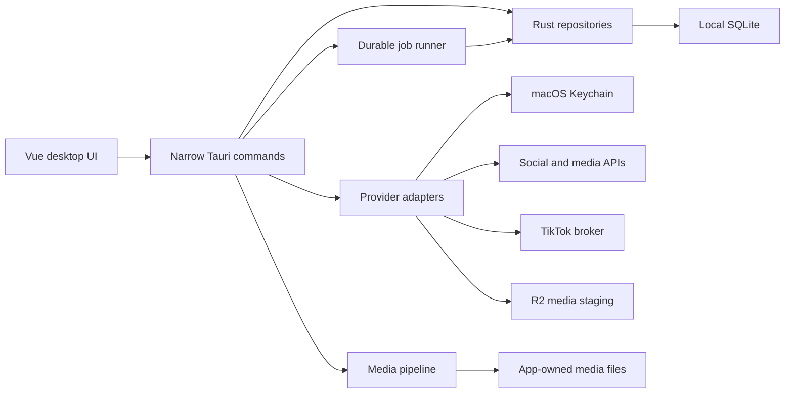

# Dust Wave Social Architecture

Audience: engineers and release maintainers.

Dust Wave Social is a local-first Tauri application. Vue owns the desktop interaction layer, Rust owns trusted local operations and provider adapters, SQLite owns durable app state, and the macOS Keychain owns secrets.

## System overview

## Repository layout

- `resources/desktop/`: independent Vue/Vite desktop entry, UI components, styles, and bundled LiteRT/model assets.
- `src-tauri/src/commands.rs`: Tauri command boundary.
- `src-tauri/src/db/`: SQLite initialization, migrations, repositories, queries, backups, jobs, reports, and system logs.
- `src-tauri/src/domain/`: serializable product and provider contracts.
- `src-tauri/src/twitter.rs`, `facebook.rs`, `mastodon.rs`, and `tiktok.rs`: provider adapters.
- `src-tauri/src/media_tools.rs` and `media_staging.rs`: local media tools and temporary public-media transport.
- `src-tauri/src/secrets.rs`: Keychain-backed service/account secret access.
- `src-tauri/migrations/`: ordered, idempotent desktop schema migrations.
- `workers/tiktok-broker/`: Cloudflare Worker and D1 storage for TikTok OAuth/analytics isolation.
- `workers/media-staging/`: Cloudflare Worker and R2 storage for short-lived Instagram media URLs.
- `scripts/`: repeatable build, packaging, release, provider-configuration, and readiness operations.

The original Mixpost Lite Laravel package remains under `src/`, `resources/js/`, `routes/`, `database/`, and `tests/`. It is a compatibility and reference layer, not a runtime dependency of the desktop product.

## Data ownership

SQLite stores non-secret product state:

- Services and non-secret service configuration.
- Social accounts and secret references.
- Posts, selected accounts, account-specific versions, and tags.
- Media metadata and derivative relationships.
- Imported posts, audience history, provider insights, and metrics.
- Durable jobs, idempotency keys, and scoped rate limits.
- Redacted system logs and provider publication records.

App-owned media lives below the Tauri app-data directory. The asset protocol is scoped to that media directory. Import and deletion code must not remove unmanaged operator files.

The macOS Keychain stores provider API keys, client secrets, access/refresh tokens, and opaque TikTok broker credentials. Backups, logs, setup packets, and onboarding exports exclude those values.

The Keychain service namespace follows the running Tauri bundle identifier, initialized before database startup. Production remains `com.dustwave.social`; alternate test bundles use their own namespace and app-data directory. Missing initialization fails closed rather than using production credentials.

## Desktop presentation state

`resources/desktop/src/appearance.js` is the single owner of the System/Light/Dark preference, persistence, macOS appearance listener, and resolved theme. It sets `data-theme` before the Vue interface mounts. CSS semantic tokens own the two palettes; canvas charts subscribe to the same resolved theme. Do not duplicate theme decisions in individual views or invert media assets with filters.

Appearance is a device preference stored in the WebView's local storage, not SQLite or Keychain. It is not included in database/media backups. The composer recovery buffer also uses WebView local storage; explicit saved drafts are SQLite records. The shared `dialogFocus.js` directive owns modal autofocus, focus trapping, and focus restoration; the existing `ContextualEditor` continues to own inline edit behavior.

`draftProtection.js` owns the replacement decision used by calendar shortcuts, opening another saved post, media-to-post creation, and clearing the composer. Keep editing is the safe exit; Save and continue must succeed before replacement. Explicit saves keep the editor open and record the exact persisted fingerprint. Recovery writes begin only after initial workspace loading/restoration, and storage failures never masquerade as saved drafts. Save/schedule/replacement operations cannot overwrite a concurrently changing composer.

`dateTime.js` is the desktop instant parsing/formatting boundary. Stored post instants remain UTC; native datetime inputs are interpreted in the saved workspace timezone, not the Mac timezone. Changing the workspace timezone converts the open draft's display without moving its instant. New ambiguous/nonexistent daylight-saving wall times are rejected with guidance; unchanged existing repeated-hour instants retain their original offset. SQLite timestamps without suffixes are UTC. Provider daily observations stay date-only values.

Rust `domain/calendar.rs` owns the aligned 42-day month, seven-day week, or one-day window. It returns inclusive display dates plus a half-open UTC interval using `chrono-tz`; the repository filters that interval and the desktop renders the returned dates. Calendar queries load all pages in that window, and stale query/report responses cannot overwrite newer navigation. Reports omit unobserved metric keys, preserve null chart points and measured zeroes, and expose the latest available observation date (not an invented last-successful-import timestamp). Both report screens reuse `ReportDataStatus` and the same import action.

## Provider boundaries

Provider-specific OAuth, validation, publishing, import, and rate-limit behavior stays in provider adapters. The shared domain capability map describes text/media constraints and supported operations so the UI can validate without embedding provider transport details.

Instagram shares Meta service credentials with Facebook Pages, but remains a first-class account and reporting provider. Static local images are uploaded to the media-staging Worker because Meta must fetch them from public HTTPS URLs.

TikTok uses a separate broker because its client secret and refresh/access tokens must not enter the desktop app. The desktop stores only the public broker URL, client key, and per-account opaque broker credential.

## Background work

Publishing and imports use the local `job_queue` table:

1. Scheduling or importing creates a durable job with an idempotency key.
2. The app-open worker reserves due pending work.
3. Provider work either completes, fails with redacted context, or returns to pending after a scoped rate limit.
4. Product-level recovery can retry failed imports, retry failed posts, or requeue stale processing jobs.

There is no Laravel queue or cron dependency in the desktop path. Because the worker is local, quitting Dust Wave Social pauses scheduled work.

## Media processing

Imported files are copied into app data and validated by MIME type and size. Image thumbnails are deterministic. Video thumbnails use FFmpeg/FFprobe when bundled or otherwise available, but video import does not hard-fail solely because those tools are absent.

Media-tool selection is shared between health diagnostics and processing. Selecting the executable for actual work does not run a version check. Health probes discard subprocess output, allow two seconds per tool, and terminate/reap an unresponsive owned child. `system_health` runs its blocking database, credential, and tool checks on Tauri's blocking pool, not the UI thread; System displays the actual available/unavailable/timeout detail without truncating recovery instructions. Only debug builds may fall back to staged source-tree tools. This bounds availability checks, not the duration of actual FFmpeg media processing. See [Tauri async commands](https://v2.tauri.app/develop/calling-rust/#async-commands) and [Rust child lifecycle](https://doc.rust-lang.org/std/process/struct.Child.html).

Release builds may bundle Apple Silicon LGPL-only FFmpeg/FFprobe sidecars. Versions, hashes, build flags, sources, and licenses are recorded in [Third-party notices](THIRD_PARTY_NOTICES.md) and validated by release scripts.

Klipy results remain external provider references. A selected GIF may be materialized only as a temporary publish-time asset and must be deleted after the attempt.

`localMediaOperation.js` owns local-helper serialization, progress, errors, and cancellation state for the runtime probe, search, profile operations, and image derivatives. Model upscaling explicitly closes cancellation with `beginCommit()` before invoking the native save command; atomic native operations are non-cancelable. Refresh failures preserve the completed output state. `LocalMediaFeedback` owns the shared status/error regions and draft-review controls; the app owns temporary alt-text edits across navigation and reuses the existing confirmation dialog before replacing edited text. This does not persist or publish alt text.

The probe and model upscaler share `localAiSession.js`. On Apple Silicon macOS 14+, `local_ai_native.rs` owns a fixed bundled LiteRT CPU helper with model-integrity validation, bounded compile/tile requests, cancellation, and child reaping. Older systems automatically use the existing `localAiModelRuntime.js` / `localAiWorkerClient.js` worker path. The canonical model manifest, overlapping tile preparation, pixel conversion, progress, and derivative-save command are shared. Inputs are bounded to 512 × 512px and are never silently downsampled. Source decoding/canvas assembly remain in the UI. The native derivative save is the only durable commit and cleans up uncommitted output on failure. See [Local AI](LOCAL_AI.md) for the authoritative runtime and safety contract.

Native CPU inference uses up to four threads without WebView isolation. The Wasm compatibility path selects JSPI-backed GPU readback or, when shared memory, cross-origin isolation, relaxed SIMD, and multiple cores are available, threaded CPU execution capped at four threads; otherwise it stays single-threaded. Threaded Emscripten children load bundled glue via `mainScriptUrlOrBlob`. No loopback server, broad IPC capability, or CSP relaxation was introduced. Keep command-line benchmarks separate from app acceptance. See [Local AI's compatibility constraints](LOCAL_AI.md#webkit-compatibility-constraints).

The worker is classic because LiteRT's loader uses [`importScripts`](https://developer.mozilla.org/en-US/docs/Web/API/WorkerGlobalScope/importScripts). [Vite](https://v5.vite.dev/guide/features#web-workers) bundles its dynamic imports into a single IIFE and serves the same entry during development. LiteRT 2.5.2's wasm-utils forwards `self.Module` to Emscripten; a narrow [`locateFile`](https://emscripten.org/docs/api_reference/module.html#Module.locateFile) hook resolves only the four reviewed Wasm filenames below `/litert/wasm/`, independent of the worker chunk's location. Keep this integration covered when upgrading LiteRT. CSP allows only same-origin workers; the worker accepts only the bundled `/litert/` base and relative model paths. No remote fallback or credential scope is added by the compatibility worker. Optional processing details are session-only UI diagnostics (model load, inference, total processing, and a 100ms UI-timer sample); they are not telemetry, persisted media metadata, or support-log data. Native-control latency and background-window timer throttling are not inference benchmarks.

## Backup and restore

A backup contains:

- The SQLite database.
- App-owned media and derivatives.
- A Dust Wave manifest describing the backup.

Restore validates the manifest, makes a safety backup, and replaces only Dust Wave-owned data. Keychain secrets are deliberately excluded, so restored accounts may require reconnection.

## Desktop permissions

The default Tauri capability is intentionally narrow:

- File-open dialogs for local media and backup/restore selection.
- Native notifications for operational outcomes.
- URL opening for OAuth handoff.
- Signed updater commands.

On each app launch, the Vue updater adapter starts one quiet signed-feed check through the same state and command path used by the manual **Check for updates** controls. The check runs alongside workspace loading, does not download or install a release, and becomes visible only when an update is available or the operator explicitly requests status. Download, signature verification, installation, and restart still require the existing operator action and Rust updater command.

Broaden permissions only when a product workflow requires it and document the decision in the launch plan and security review.

## Design constraints

- Keep the desktop host local-first and free of hidden telemetry or cloud AI fallbacks.
- Limit the automatic launch check to the public signed release feed; do not attach credentials, account data, posts, media, logs, reports, or device profiling.
- Require visible operator intent for externally visible or destructive actions.
- Keep migrations, schema details, raw queues, and database inspection out of production UI.
- Preserve original media and create explicit derivatives.
- Redact secrets while retaining actionable failure context.
- Treat provider API changes as capability and acceptance changes, not only transport changes.
- Run the product-risk review in `BEST_PRACTICES.md` for changes to publishing, automation, credentials, media, analytics, backups, notifications, or support exports.
