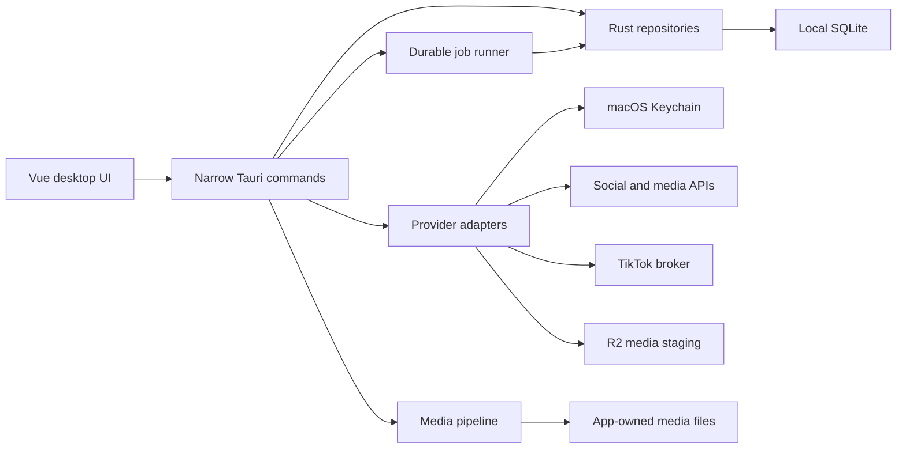

# Dust Wave Social Architecture

Audience: engineers and release maintainers.

Dust Wave Social is a local-first Tauri application. Vue owns the desktop interaction layer, Rust owns trusted local operations and provider adapters, SQLite owns durable app state, and the macOS Keychain owns secrets.

## System overview

## Repository layout

- `resources/desktop/`: independent Vue/Vite desktop entry, UI components, styles, and bundled LiteRT/model assets.
- `src-tauri/src/commands.rs`: Tauri command boundary.
- `src-tauri/src/db/`: SQLite initialization, migrations, repositories, queries, backups, jobs, reports, and system logs.
- `src-tauri/src/domain/`: serializable product and provider contracts.
- `src-tauri/src/twitter.rs`, `facebook.rs`, `mastodon.rs`, and `tiktok.rs`: provider adapters.
- `src-tauri/src/media_tools.rs` and `media_staging.rs`: local media tools and temporary public-media transport.
- `src-tauri/src/secrets.rs`: Keychain-backed service/account secret access.
- `src-tauri/migrations/`: ordered, idempotent desktop schema migrations.
- `workers/tiktok-broker/`: Cloudflare Worker and D1 storage for TikTok OAuth/analytics isolation.
- `workers/media-staging/`: Cloudflare Worker and R2 storage for short-lived Instagram media URLs.
- `scripts/`: repeatable build, packaging, release, provider-configuration, and readiness operations.

The original Mixpost Lite Laravel package remains under `src/`, `resources/js/`, `routes/`, `database/`, and `tests/`. It is a compatibility and reference layer, not a runtime dependency of the desktop product.

## Data ownership

SQLite stores non-secret product state:

- Services and non-secret service configuration.
- Social accounts and secret references.
- Posts, selected accounts, account-specific versions, and tags.
- Media metadata and derivative relationships.
- Imported posts, audience history, provider insights, and metrics.
- Durable jobs, idempotency keys, and scoped rate limits.
- Redacted system logs and provider publication records.

App-owned media lives below the Tauri app-data directory. The asset protocol is scoped to that media directory. Import and deletion code must not remove unmanaged operator files.

The macOS Keychain stores provider API keys, client secrets, access/refresh tokens, and opaque TikTok broker credentials. Backups, logs, setup packets, and onboarding exports exclude those values.

## Provider boundaries

Provider-specific OAuth, validation, publishing, import, and rate-limit behavior stays in provider adapters. The shared domain capability map describes text/media constraints and supported operations so the UI can validate without embedding provider transport details.

Instagram shares Meta service credentials with Facebook Pages, but remains a first-class account and reporting provider. Static local images are uploaded to the media-staging Worker because Meta must fetch them from public HTTPS URLs.

TikTok uses a separate broker because its client secret and refresh/access tokens must not enter the desktop app. The desktop stores only the public broker URL, client key, and per-account opaque broker credential.

## Background work

Publishing and imports use the local `job_queue` table:

1. Scheduling or importing creates a durable job with an idempotency key.
2. The app-open worker reserves due pending work.
3. Provider work either completes, fails with redacted context, or returns to pending after a scoped rate limit.
4. Product-level recovery can retry failed imports, retry failed posts, or requeue stale processing jobs.

There is no Laravel queue or cron dependency in the desktop path. Because the worker is local, quitting Dust Wave Social pauses scheduled work.

## Media processing

Imported files are copied into app data and validated by MIME type and size. Image thumbnails are deterministic. Video thumbnails use FFmpeg/FFprobe when bundled or otherwise available, but video import does not hard-fail solely because those tools are absent.

Release builds may bundle Apple Silicon LGPL-only FFmpeg/FFprobe sidecars. Versions, hashes, build flags, sources, and licenses are recorded in `../THIRD_PARTY_NOTICES.md` and validated by release scripts.

Klipy results remain external provider references. A selected GIF may be materialized only as a temporary publish-time asset and must be deleted after the attempt.

## Backup and restore

A backup contains:

- The SQLite database.
- App-owned media and derivatives.
- A Dust Wave manifest describing the backup.

Restore validates the manifest, makes a safety backup, and replaces only Dust Wave-owned data. Keychain secrets are deliberately excluded, so restored accounts may require reconnection.

## Desktop permissions

The default Tauri capability is intentionally narrow:

- File-open dialogs for local media and backup/restore selection.
- Native notifications for operational outcomes.
- URL opening for OAuth handoff.
- Signed updater commands.

Broaden permissions only when a product workflow requires it and document the decision in the launch plan and security review.

## Design constraints

- Keep the desktop host local-first and free of hidden telemetry or cloud AI fallbacks.
- Require visible operator intent for externally visible or destructive actions.
- Keep migrations, schema details, raw queues, and database inspection out of production UI.
- Preserve original media and create explicit derivatives.
- Redact secrets while retaining actionable failure context.
- Treat provider API changes as capability and acceptance changes, not only transport changes.
- Run the product-risk review in `BEST_PRACTICES.md` for changes to publishing, automation, credentials, media, analytics, backups, notifications, or support exports.
